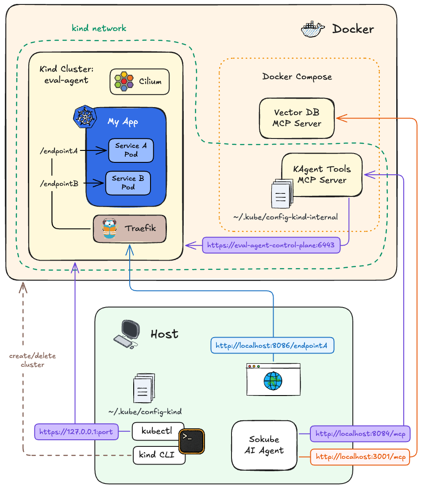

# Local Execution Environment for Agents

This guide explains how to spin up a local execution environment for:
- running agents against a throwaway Kubernetes cluster
- exposing tools to agents via MCP servers running in Docker


## 📦 What you get

- **Kind cluster** running as a single Docker container (control plane + worker node), where demo applications are deployed
- **Cilium CNI** in `kube-system` for pod networking and network policies
- **Traefik ingress controller** in the `traefik` namespace, routing HTTP traffic to application services inside the cluster via a port-forward on `localhost:${INGRESS_PORT}`
- **Two kubeconfigs** written to `~/.kube/`:
  - `${KUBECONFIG_NAME}` for `kubectl` on the host
  - `${KUBECONFIG_NAME}-internal` for Docker containers that need to reach the Kubernetes API
- **MCP servers** via Docker Compose:
  - `vector-db-mcp` at `http://localhost:3001/mcp`
  - `kagent-tools-mcp` at `http://localhost:8084/mcp`

### Architecture

<table border="0" cellpadding="0" cellspacing="0">
<tr>
<td width="55%">
  
</td>
<td width="45%">

**Host machine**

- Runs agent code
  - Agents connect to MCP servers over HTTP
- Creates and deletes the Kind cluster
- Stores kubeconfigs that allow `kubectl` to access Kubernetes from:
  - **Host**: `~/.kube/${KUBECONFIG_NAME}`
  - **Docker containers**: `~/.kube/${KUBECONFIG_NAME}-internal`

**Docker Compose**

- Exposes MCP services:
  - `vector-db-mcp` at `http://localhost:3001/mcp`
  - `kagent-tools-mcp` at `http://localhost:8084/mcp`
- Attaches `kagent-tools-mcp` to the `kind` Docker network
- Mounts `~/.kube` so `kagent-tools-mcp` can reach the Kubernetes API at `https://eval-agent-control-plane:6443`

**Kind cluster**

- Runs as a single Docker container acting as both control plane and worker node
- Includes a _Traefik ingress controller_ (installed in the `traefik` namespace) that routes HTTP requests to Kubernetes services using `Ingress` rules
  - A `LoadBalancer` service exposes Traefik's HTTP port `80` inside the cluster
  - A `port-forward` maps `localhost:${INGRESS_PORT}` to `traefik:80`, allowing the host to reach services inside the cluster
- Uses _Cilium_ (installed in the `kube-system` namespace) as the CNI (Container Network Interface) for pod-to-pod networking and enforcing network security policies
  - Enables `CiliumNetworkPolicy` resources, providing more granular control than standard Kubernetes `NetworkPolicy`
- The _My App_ user application is shown as an example but is not included

</td></tr></table>

## 📁 Directory contents

- `create-cluster.sh`: Creates the Kind cluster, installs Cilium and Traefik via Helm, sets up port-forwarding, and writes both kubeconfigs.
- `destroy-cluster.sh`: Tears down the Kind cluster, kills port-forwarding, and removes generated kubeconfigs.
- `export_env.sh`: Sources the project root `.env` and exports default environment variables (e.g. `KIND_CLUSTER_NAME`, `KUBECONFIG`, `CILIUM_VERSION`).
- `kind-config.yaml`: Kind cluster node configuration.
- `docker-compose.mcp.yml`: Docker Compose for the MCP servers (`vector-db-mcp`, `kagent-tools-mcp`).

## 🧩 Prerequisites

- Docker and Docker Compose (e.g. [Docker Desktop](https://docs.docker.com/compose/install/))
- [`kind` CLI](https://kind.sigs.k8s.io/docs/user/quick-start/#installing-from-release-binaries)
- [`helm` CLI](https://helm.sh/docs/intro/install/)
- [`kubectl`](https://kubernetes.io/docs/tasks/tools/#kubectl)

## ⚙️ Configure environment variables

1. Copy the example environment file at the project root:

   ```bash
   cp .env.example .env
   ```

2. Edit `.env` and set your keys:

   ```bash
   OPENAI_API_KEY=your_api_key # model provider key (required)
   OPIK_API_KEY=your_api_key   # Comet Opik tracing (optional)
   ```

3. Default values set by `export_env.sh`:

   ```bash
   KIND_CLUSTER_NAME="eval-agent"
   KUBERNETES_IMAGE_TAG="v1.34.0@sha256:7416a61b42b1662ca6ca89f02028ac133a309a2a30ba309614e8ec94d976dc5a"
   KUBECONFIG_NAME="config-kind-eval-agent"
   KUBECONFIG="${HOME}/.kube/${KUBECONFIG_NAME}"

   # CNI version
   CILIUM_VERSION="1.18.3"

   # MCP server versions
   KAGENT_TOOLS_VERSION="0.0.12"

   # localhost:8086 → traefik:80 (cluster)
   INGRESS_PORT=8086
   ```

## 🚀 Usage

```bash
# Create cluster (skips if already exists)
infra/local/create-cluster.sh

# Destroy any existing cluster first, then create
infra/local/create-cluster.sh --recreate

# Destroy cluster
infra/local/destroy-cluster.sh

# Start MCP servers
docker compose -f infra/local/docker-compose.mcp.yml up -d

# Stop MCP servers
docker compose -f infra/local/docker-compose.mcp.yml down -v
```

## ✅ Verify the Environment is Running

### List Docker containers

```bash
docker ps
```

You should see entries similar to:

```bash
CONTAINER ID   IMAGE                                    COMMAND                  CREATED              STATUS              PORTS                                         NAMES
eaa687205fa1   mcp-sqlite-vec:latest                    "node build/index.js"    About a minute ago   Up About a minute   0.0.0.0:3001->3001/tcp, [::]:3001->3001/tcp   mcp-sqlite-vec
d650e8700c6a   ghcr.io/kagent-dev/kagent/tools:0.0.12   "/tool-server --kube…"   About a minute ago   Up About a minute   0.0.0.0:8084->8084/tcp, [::]:8084->8084/tcp   mcp-kagent
177dada39e51   kindest/node:v1.34.0                     "/usr/local/bin/entr…"   About a minute ago   Up About a minute   127.0.0.1:56733->6443/tcp                     eval-agent-control-plane
```

### View MCP server logs:

```bash
docker compose -f infra/local/docker-compose.mcp.yml logs -f
```

## ⚙️ Configure `kubectl`

To interact with the local Kubernetes, load the `${KUBECONFIG}` environment variable:

```bash
source infra/local/export_env.sh
```

Verify that `kubectl` is using the correct context:

```bash
kubectl config current-context

# Expected output:
kind-eval-agent
```

Interact with the cluster as usual:

```bash
# List all pods
kubectl get pods --all-namespaces

# Expected output:
NAMESPACE            NAME                                               READY   STATUS    RESTARTS   AGE
kube-system          cilium-8qg78                                       1/1     Running   0          20s
kube-system          cilium-envoy-v8ctb                                 1/1     Running   0          20s
kube-system          cilium-operator-68bd8cc456-ddrcs                   1/1     Running   0          20s
kube-system          coredns-66bc5c9577-2cr9z                           1/1     Running   0          28s
kube-system          coredns-66bc5c9577-6pl7v                           1/1     Running   0          28s
kube-system          etcd-eval-agent-control-plane                      1/1     Running   0          37s
kube-system          kube-apiserver-eval-agent-control-plane            1/1     Running   0          37s
kube-system          kube-controller-manager-eval-agent-control-plane   1/1     Running   0          36s
kube-system          kube-proxy-kq9xb                                   1/1     Running   0          29s
kube-system          kube-scheduler-eval-agent-control-plane            1/1     Running   0          36s
local-path-storage   local-path-provisioner-7b8c8ddbd6-cndvw            1/1     Running   0          28s
traefik              traefik-7bcc5696fd-blhxl                           1/1     Running   0           1s
```

```bash
# List all nodes
kubectl get nodes

# Expected output:
NAME                       STATUS   ROLES           AGE   VERSION
eval-agent-control-plane   Ready    control-plane   98s   v1.34.0
```
